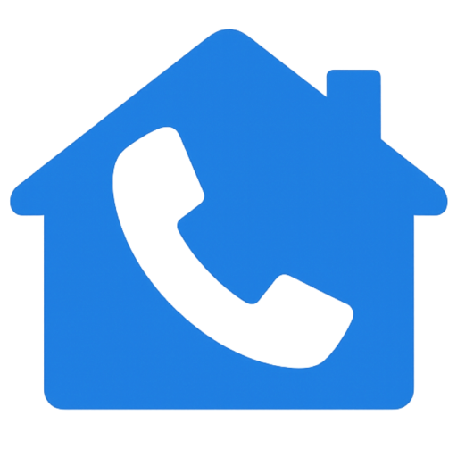
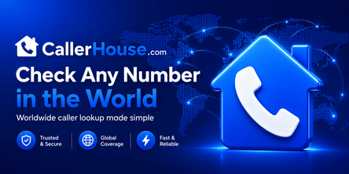

  

  <h1>CallerHouse.com</h1>

  

    <strong>Reverse phone lookup, spam number reports, and caller reputation worldwide.</strong>
  

  

    Identify unknown callers, check spam risk, read community reports, and make safer callback decisions before you answer or return a missed call.
  

  

    
    
    
    
  

  

## Unknown caller? Search before you call back

[CallerHouse](https://callerhouse.com) is a public caller reputation platform for people who want a fast, privacy-conscious way to understand unknown phone numbers. Search a number to find community spam votes, caller reports, recent activity, country context, and practical safety signals for missed calls, robocalls, telemarketing, spoofed caller ID, and suspected phone scams.

The project is built around a simple idea: public caller experiences are more useful when they are searchable, organized, moderated, and easy to understand.

## What you can do

| Feature | Public page |
| --- | --- |
| Search unknown phone numbers and caller ID signals | [CallerHouse search](https://callerhouse.com) |
| Review high-risk and recently reported spam numbers | [Trending spam numbers](https://callerhouse.com/spam) |
| Browse lookup and reporting activity | [Recent activity](https://callerhouse.com/recent) |
| Compare the most searched phone numbers | [Top searched numbers](https://callerhouse.com/top-searched) |
| Read the most discussed caller reports | [Most discussed numbers](https://callerhouse.com/most-commented) |
| Discover newly reported numbers | [Newly reported numbers](https://callerhouse.com/newly-reported) |
| Follow fresh community comments and reports | [Fresh reports](https://callerhouse.com/new-comments) |
| Browse caller reports by country | [Countries directory](https://callerhouse.com/countries) |

## Popular lookup regions

[United States](https://callerhouse.com/country/US) ·
[United Kingdom](https://callerhouse.com/country/GB) ·
[Canada](https://callerhouse.com/country/CA) ·
[Australia](https://callerhouse.com/country/AU) ·
[India](https://callerhouse.com/country/IN) ·
[Germany](https://callerhouse.com/country/DE)

## Phone safety resources

CallerHouse publishes practical guides for safer caller ID lookup, reverse phone lookup, and phone scam prevention:

- [CallerHouse Blog](https://callerhouse.com/blog)
- [How Can I Trace a Caller ID? A Complete Guide](https://callerhouse.com/blog/how-can-i-trace-a-caller-id)
- [8 Signs You're Talking to a Phone Scammer](https://callerhouse.com/blog/signs-you-are-talking-to-a-phone-scammer)
- [Why You Should Never Call Back Unknown Numbers](https://callerhouse.com/blog/why-you-should-never-call-back-unknown-numbers)
- [The Ultimate Guide to Reverse Phone Lookup Services](https://callerhouse.com/blog/ultimate-guide-to-reverse-phone-lookup)
- [Glossary of caller ID, robocall, spoofing, and scam terms](https://callerhouse.com/glossary)
- [Frequently asked questions](https://callerhouse.com/faq)
- [CallerHouse methodology](https://callerhouse.com/methodology)

## Community-first caller reputation

CallerHouse helps people evaluate unknown calls through:

- Community spam votes and caller reports
- Phone number reputation signals and risk context
- Country-specific spam number directories
- Recent activity, top searched numbers, and fresh reports
- Plain-language education about robocalls, spoofing, phishing, smishing, Wangiri scams, and caller ID safety
- Moderation and review flows for disputed or sensitive content

## Important links

| Resource | Link |
| --- | --- |
| Official website | [callerhouse.com](https://callerhouse.com) |
| Blog | [callerhouse.com/blog](https://callerhouse.com/blog) |
| Spam numbers | [callerhouse.com/spam](https://callerhouse.com/spam) |
| Contact | [callerhouse.com/contact](https://callerhouse.com/contact) |
| Report abuse or request removal | [callerhouse.com/report](https://callerhouse.com/report) |
| Business number review | [callerhouse.com/business-review](https://callerhouse.com/business-review) |
| Privacy policy | [callerhouse.com/privacy](https://callerhouse.com/privacy) |
| Terms of use | [callerhouse.com/terms](https://callerhouse.com/terms) |
| Cookie policy | [callerhouse.com/cookie-policy](https://callerhouse.com/cookie-policy) |
| Disclaimer | [callerhouse.com/disclaimer](https://callerhouse.com/disclaimer) |

## For public visitors

This GitHub organization profile is a public project overview for CallerHouse. It intentionally describes the product, safety mission, public resources, and official links only. It does not publish private architecture details, internal codebase information, backend implementation notes, credentials, secrets, or operational infrastructure.

  

    <strong>Search first. Call back safer.</strong>
  

  

    <a href="https://callerhouse.com">Open CallerHouse</a> ·
    <a href="https://callerhouse.com/spam">Browse spam reports</a> ·
    <a href="https://callerhouse.com/blog">Read phone safety guides</a> ·
    <a href="mailto:support@callerhouse.com">support@callerhouse.com</a>
  

